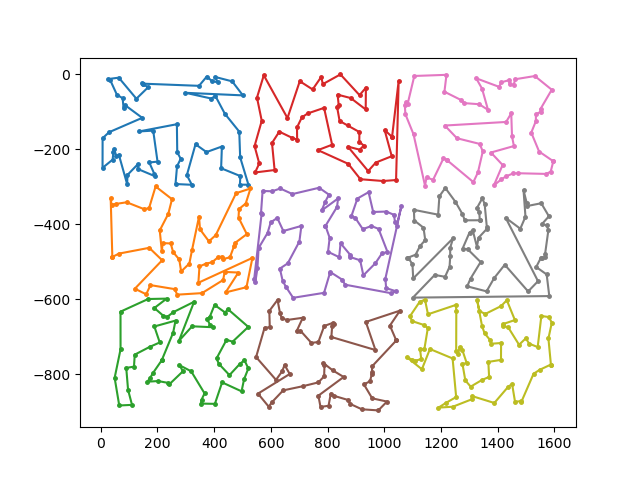
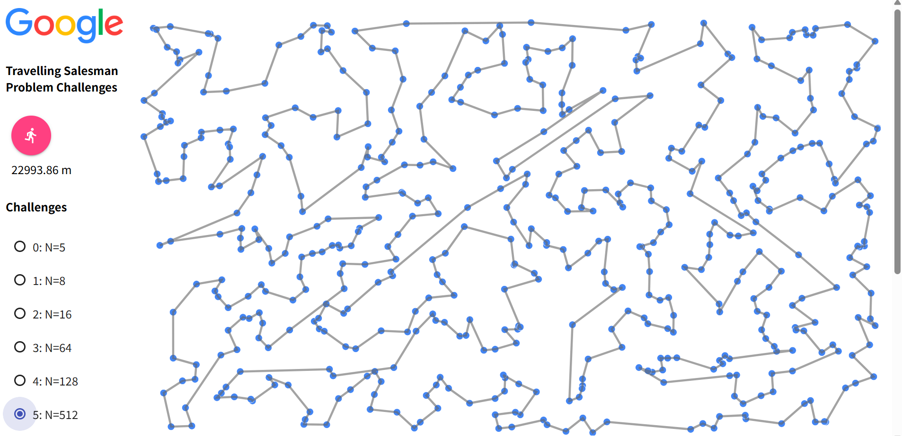
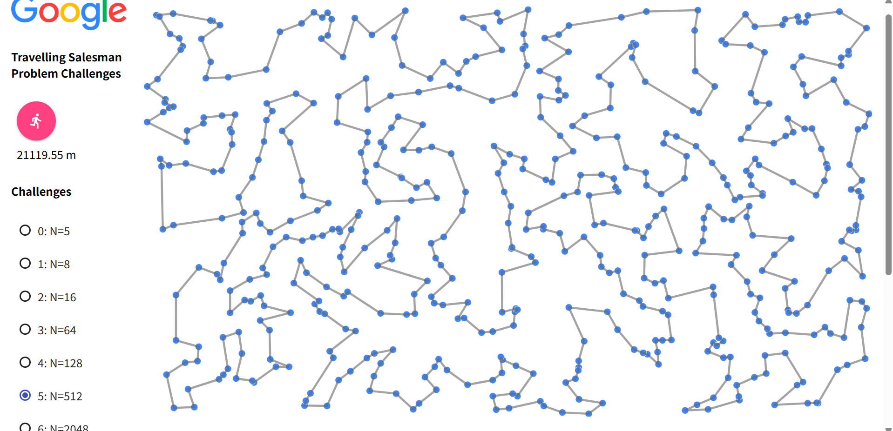
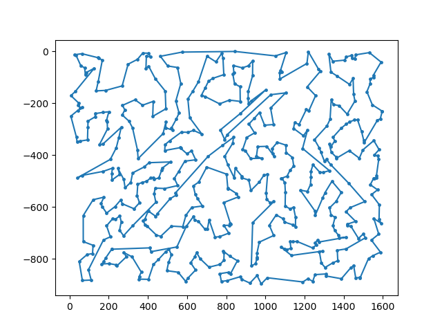
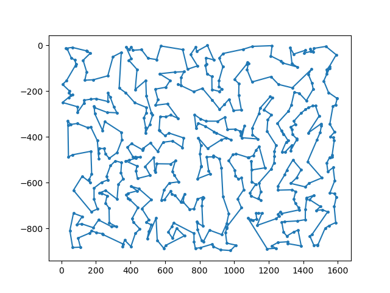

# TSP チェレンジ

## 方針
n × ｎ の領域に分けて、各領域で 貪欲法+2-opt法を適用し部分巡回路を計算する

イメージ：

その後、巡回路同士を結合し、1つの巡回路にする

イメージ：

## 背景
greedy + 2-opt法 による経路（上）と、SA法による経路（下）を見比べると、SA法はきれいにセクションに分かれているように見えたので、それを再現して短い経路を算出できないか試してみようと思いました。

## 実装
### 1. クラスタリング（make_clusters()）

都市を座標に基づいて n×n に分割し、各都市を対応する領域へ割り当てる。領域内の都市数が少なすぎる（4つ未満）場合は隣接領域と統合することで、部分巡回路作成やクラスターの結合で不具合が生じないようにする。

### 2. 部分巡回路の構築

#### a. 貪欲法（tsp_greedy()）
各領域内で最近傍貪欲法を用いて巡回路を作成する。現在位置から最も近い未訪問都市を順に選択し、全都市を訪問した後に始点へ戻る。

#### b. 2-optによる部分巡回路の改善（apply_2opt()）

貪欲法で作成した巡回路には交差が含まれることがあるため、2-opt法によって改善する。2本の辺を巡査し、交差していた場合辺を張り替えて巡回路長を短縮する。この処理を交差がなくなるまで最大10回繰り返す。

### 3. 巡回路の結合（joint_clusters()）

各領域で得られた部分巡回路同士を結合する。異なる巡回路に属する辺の組について、辺を繋ぎ替えたときの距離変化を計算し、巡回路長の増加が最も小さい組み合わせを選択する。これを繰り返して全ての巡回路を1つに統合する。

### 4. 全体巡回路の改善（apply_2opt()）

巡回路の結合後にも非効率な経路が残る可能性があるため、全体巡回路に対して再度2-opt法を適用する。

### 5. 全体処理（solve()）

以上の処理をまとめた流れは以下の通りである。

クラスタリング（make_clusters()）

各クラスタで貪欲法を実行（tsp_greedy()）

各クラスタに2-optを適用（apply_2opt()）

クラスタ同士を結合（joint_clusters()）

全体に2-optを適用（apply_2opt()）

巡回路を出力（graph_to_city_id_tour()）

なお、分割数 n を 1～9 の範囲で変化させながら解を生成し、最も巡回路長が短い結果を出力した。

## 結果

| solver | N=5 | N=8 | N=16 | N=64 | N=128 | N=512 | N=2048 |
|--------|-----|-----|------|------|-------|-------|--------|
| random | 3418.10 | 3832.29 | 5449.44 | 10519.16 | 12684.06 | 25331.84 | 49892.05 |
| sa | 3291.62 | 3778.72 | 4494.42 | 8150.91 | 10675.29 | 21119.55 | 44393.89 |
| simple2opt | 3418.10 | 3832.29 | 4974.50 | 10155.75 | 11995.75 | 22993.86 | 45914.72 |
| cluster | 3418.10 | 3832.29 | 4494.41 | 8500.29 | 11131.44 | 21363.60 |  42712.37 |

シンプルな greedy + 2-opt法（今回のクラスター法の n = 1 にあたる）と、あまり変わりませんでした...泣 

## 考察
input_5.csv について、各分割数での巡回路長を表にすると以下の通り。

| 分割数 n | 巡回路長 |
|----------|----------|
| 1 |  21363.60 |
| 2 |  21677.22 |
| 3 |  21745.07 |
| 4 |  22288.00 |
| 5 |  22169.03 |
| 6 |  22142.90 |
| 7 |  22101.93 |
| 8 |  22400.53 |
| 9 |  22059.69 |

これをみると、せいぜい2, 3分割でしか効果はなく、全体的に誤差程度でしか効果がないようです。

n = 1：
<

n = 3：

n = 9：

近傍の点が見つからなくて無理やりつなげるしかなくなる、という構造自体は解消できてないから？
